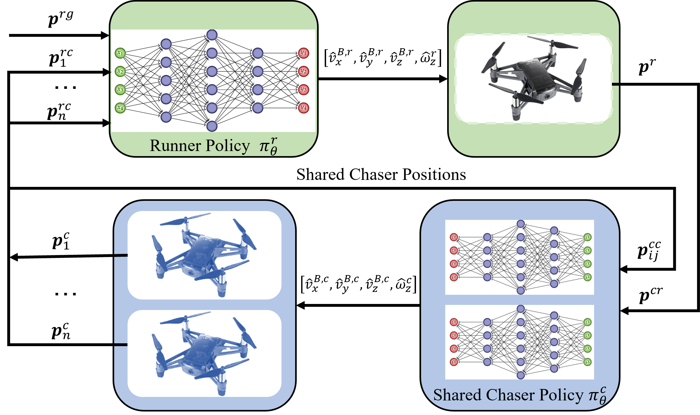

# AMS-DRL-for-Pursuit-Evasion
This is the repository for the paper entitled "AMS-DRL: Learning Multi-Pursuit Evasion for Safe Targeted Navigation of Drones".  
If you are interested, we would appreciate using the following citation:  
```
@article{xiao2023ams,
  title={AMS-DRL: Learning Multi-Pursuit Evasion for Safe Targeted Navigation of Drones},
  author={Xiao, Jiaping and Feroskhan, Mir},
  journal={arXiv preprint arXiv:2304.03443},
  year={2023}
}
```

## Abstract
Safe navigation of drones in the presence of adversarial physical attacks from multiple pursuers is a challenging task. This paper proposes a novel approach, asynchronous multi-stage deep reinforcement learning (AMS-DRL), to train an adversarial neural network that can learn from the actions of multiple pursuers and adapt quickly to their behavior, enabling the drone to avoid attacks and reach its target. Our approach guarantees convergence by ensuring Nash Equilibrium among agents from the game-theory analysis. We evaluate our method in extensive simulations and show that it outperforms baselines with higher navigation success rates. We also analyze how parameters such as the relative maximum speed affect navigation performance. Furthermore, we have conducted physical experiments and validated the effectiveness of the trained policies in real-time flights. A success rate heatmap is introduced to elucidate how spatial geometry influences navigation outcomes.

## Network Achitecture
<div style="text-align: center">

</div>

## Physical Experiment Demo
<div style="text-align: center">

</div>

## Code and Procedure
### Requirements:
1. Ubuntu 18.04
2. ROS Melodic
3. Python 2
4. Tello driver from https://github.com/xjp99v5/tello-driver-ros 
5. ONNX

### Steps:
1. roslaunch vrpn_client_ros drone.launch
2. python multiple_drone_laucher.py
3. python swarm_test.py.
4. python landTello.py

********************************************************
### Bugs:
1. cannot install the onnx package  
sol:   export CMAKE_ARGS="-DONNX_USE_PROTOBUF_SHARED_LIBS=ON"

2. cannot run the multiple_drone_laucher.py  
sol: make sure the tello driver is activated and all drones are in the same network.
